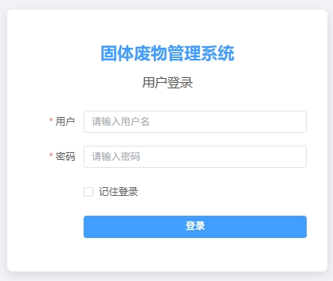
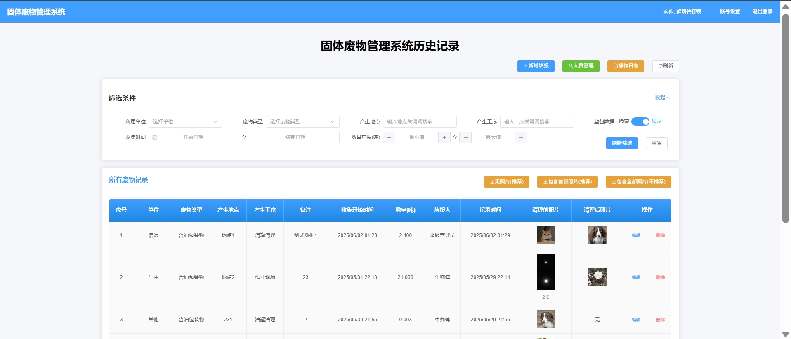
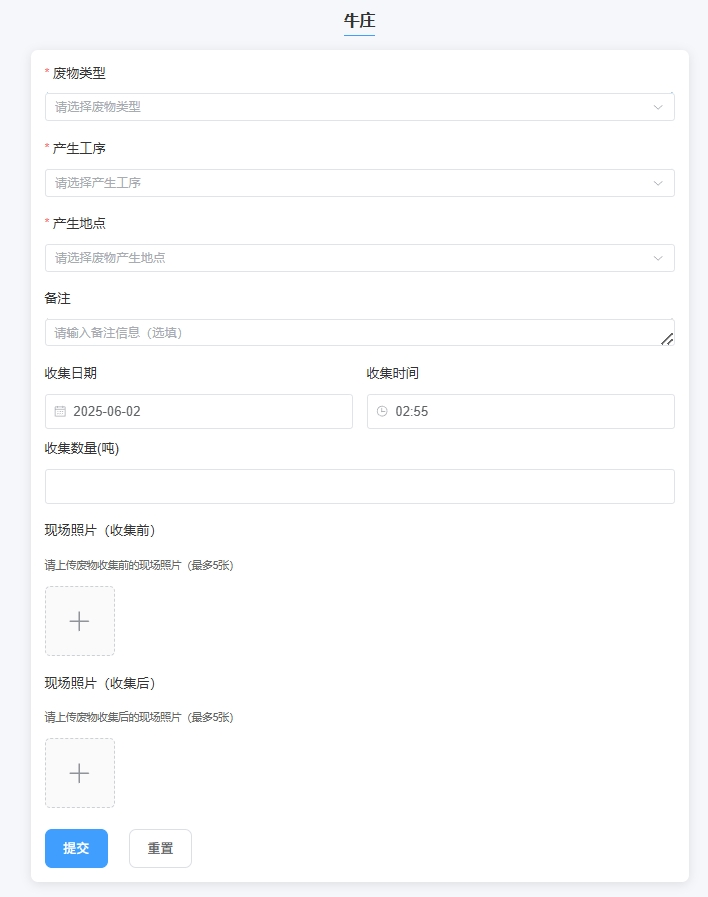
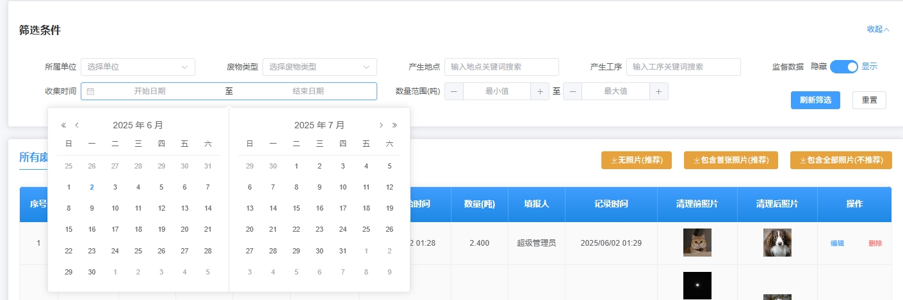
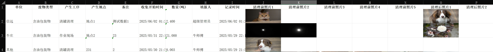
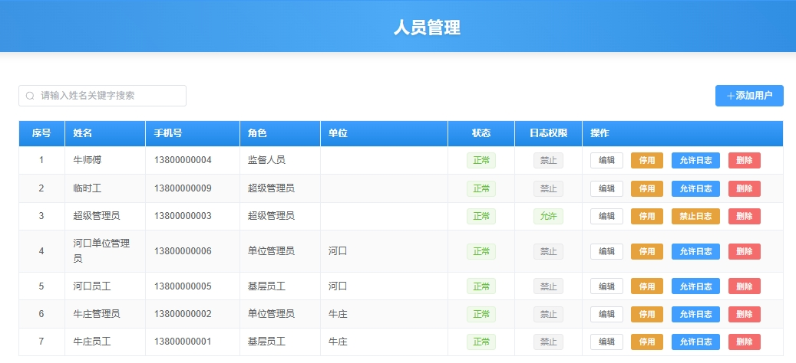
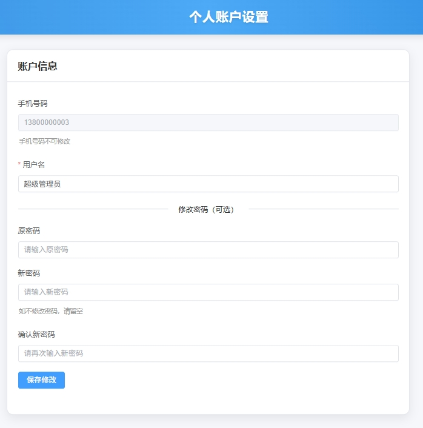
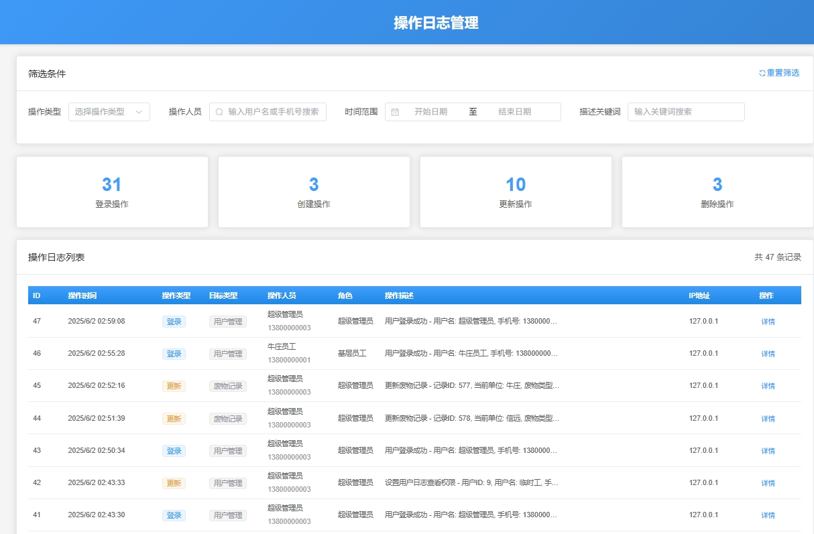
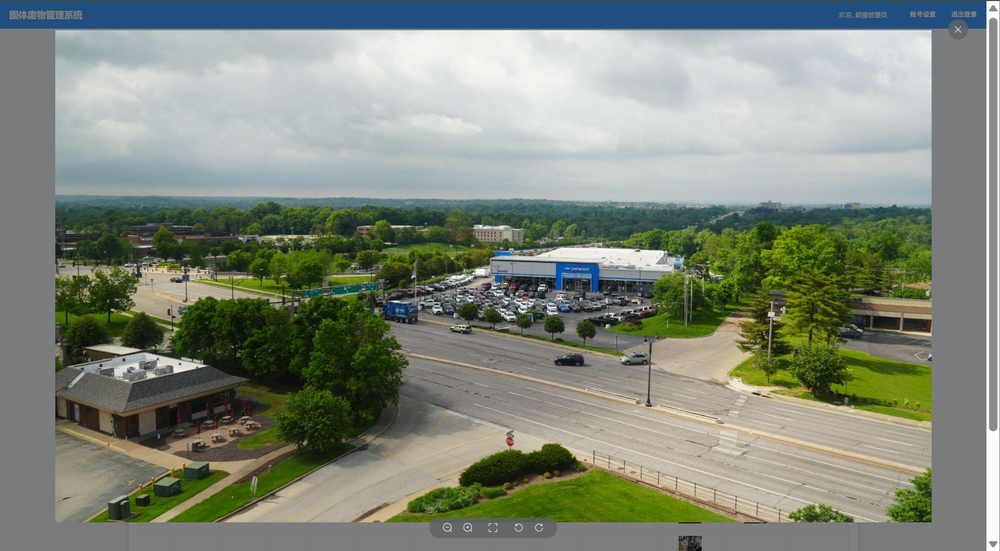

# 固体废物管理系统说明书

## 一、系统概述

### 1.1 系统简介

固体废物管理系统是一个基于现代Web技术开发的企业级废物管理平台，采用Vue 3 + Node.js + MySQL的技术架构，实现了对固体废物从产生到处理全过程的数字化管理。系统以MVC架构设计，具有良好的可扩展性和维护性。

### 1.2 核心特点

- **多级权限管理**：四级用户权限体系，满足不同岗位的管理需求
- **全程追溯记录**：详细记录废物产生、收集、处理的每个环节
- **照片证据管理**：支持收集前后照片上传，确保记录真实性
- **操作日志审计**：完整的操作日志系统，实现行为可追溯
- **移动端适配**：响应式设计，支持手机、平板等移动设备使用

Fig1: 登录界面

## 二、系统架构

### 2.1 技术架构

系统采用前后端分离的架构设计：

- **前端技术栈**
  - Vue 3 + Composition API：现代化的前端框架
  - Element Plus：企业级UI组件库
  - Vue Router：路由管理
  - Vuex：状态管理

- **后端技术栈**
  - Node.js + Express：高性能的服务器框架
  - MySQL 8.0+：关系型数据库
  - JWT：安全的身份认证
  - Multer：文件上传处理

- **架构模式**
  - MVC（Model-View-Controller）：清晰的分层架构
  - RESTful API：标准化的接口设计
  - 中间件机制：灵活的功能扩展

### 2.2 数据库设计

系统包含以下核心数据表：

1. **用户表（users）**：存储系统用户信息
2. **角色表（user_roles）**：定义用户角色权限
3. **单位表（units）**：管理各个基础单位
4. **废物类型表（waste_types）**：废物分类管理
5. **废物记录表（waste_records）**：废物记录核心数据
6. **操作日志表（operation_logs）**：系统操作审计日志

## 三、功能模块

### 3.1 用户权限体系

系统实现了四级权限管理体系(登录自动识别权限)：

#### 3.1.1 超级管理员（角色ID：3）
- 查看所有单位的废物记录
- 管理所有用户账号
- 修改任意废物记录
- 查看操作日志（需额外授权）
- 管理单位和废物类型

Fig2: 超级管理员记录查看页面

#### 3.1.2 单位管理员（角色ID：2）

- 查看本单位所有废物记录
- 管理本单位用户账号
- 编辑本单位废物记录
- 导出本单位数据报表

#### 3.1.3 基层员工（角色ID：1）
- 填报废物记录
- 查看个人填报记录（48小时内）
- 编辑个人填报记录
- 基础数据导出

#### 3.1.4 监督人员（角色ID：4）
- 独立的监督数据录入
- 查看和管理个人录入的监督数据
- 监督数据与普通数据分离管理

### 3.2 废物记录管理

#### 3.2.1 记录填报
废物记录包含以下信息：
- **基础信息**：单位、废物类型、产生位置
- **时间信息**：收集日期和具体时间
- **工序信息**：作业现场、清罐清理、报废清理等
- **数量信息**：收集数量（吨）
- **照片记录**：收集前照片（≤5张）、收集后照片（≤5张）
- **备注信息**：其他补充说明

Fig3: 记录填报页面

#### 3.2.2 记录查询与筛选

- 按单位筛选
- 按废物类型筛选
- 按产生位置筛选
- 按产生工序筛选
- 按数量范围筛选
- 按时间范围筛选
- 实时搜索与防抖优化

Fig4: 实时筛选功能

#### 3.2.3 数据导出

系统支持三种导出方式：
1. **无照片导出**：仅导出文字信息
2. **包含首张照片**：每类照片导出第一张
3. **包含全部照片**：导出所有照片（最多10张）

Fig5: 导出样例

### 3.3 用户管理

#### 3.3.1 用户信息管理

用户管理采用权限分级设计。超级用户具有管理全部用户权限，单位管理员具有管理该单位所有员工用户权限

- 创建新用户账号
- 修改用户信息
- 设置用户角色和所属单位
- 启用/停用账号
- 重置用户密码

Fig6: 员工账户管理页面

#### 3.3.2 个人资料管理

- 修改个人用户名
- 更改登录密码
- 查看个人信息

Fig7: 修改个人账户信息

### 3.4 操作日志系统

#### 3.4.1 日志记录内容
- **登录日志**：成功/失败、IP地址、设备信息
- **数据操作**：创建、修改、删除记录的详细信息
- **用户管理**：账号创建、修改、权限变更
- **系统管理**：单位、废物类型的管理操作

#### 3.4.2 日志查询功能
- 按操作类型筛选
- 按操作人员搜索（支持用户名/手机号）
- 按时间范围查询
- 按关键词搜索
- 详细的操作前后数据对比

Fig8: 操作日志

## 四、使用指南

### 4.1 登录系统

1. 打开系统登录页面
2. 输入手机号和密码
3. 可选择"记住登录"保持登录状态
4. 点击"登录"按钮进入系统

默认测试账号：
- 超级管理员：13800000003 / 密码：1
- 单位管理员：13800000002 / 密码：1
- 基层员工：13800000001 / 密码：1
- 监督人员：13800000004 / 密码：1

### 4.2 填报废物记录

1. 登录系统后进入填报页面
2. 填写必填信息：
   - 选择废物类型
   - 输入产生位置
   - 选择产生工序
   - 设置收集时间
3. 上传照片（可选）：
   - 收集前照片（最多5张）
   - 收集后照片（最多5张）
4. 填写收集数量和备注（可选）
5. 点击"提交"完成填报
6. 填报成功后自动跳转

### 4.3 查看和管理记录

1. 进入记录列表页面
2. 使用筛选功能查找特定记录
3. 点击"编辑"修改记录信息
4. 点击"删除"移除错误记录
5. 使用导出功能生成报表

### 4.4 用户管理操作

1. 进入用户管理页面（需管理员权限）
2. 点击"新增用户"创建账号
3. 设置用户信息：
   - 用户名和手机号
   - 初始密码
   - 角色权限
   - 所属单位
4. 使用"编辑"修改用户信息
5. 使用"启用/停用"管理账号状态

## 五、系统特色功能

### 5.1 照片管理系统

- **智能照片存储**：自动压缩和优化上传的照片
- **批量上传**：支持一次上传多张照片
- **预览功能**：点击照片可查看大图
- **增量更新**：编辑时可追加新照片或删除指定照片

Fig9: 图片查看

### 5.2 监督数据管理

- **数据隔离**：监督数据与普通数据分开管理
- **独立权限**：监督人员只能查看和管理自己的数据
- **标识区分**：监督数据在系统中有明确标识
- **审计追踪**：所有监督数据操作记录在日志中

### 5.3 移动端优化

- **响应式布局**：自适应不同屏幕尺寸
- **触屏优化**：支持手势操作
- **移动拍照**：直接调用手机相机拍照上传
- **离线缓存**：支持离线查看已加载数据

## 六、数据安全与备份

### 6.1 安全机制

1. **身份认证**：JWT令牌认证，支持过期自动续期
2. **权限控制**：基于角色的访问控制（RBAC）
3. **数据加密**：密码使用bcrypt加密存储
4. **操作审计**：所有关键操作记录日志
5. **防重放攻击**：请求时间戳验证

### 6.2 数据备份

1. **数据库及照片备份**：
   - 每日自动备份全部数据
   - 保留最近3天的备份

## 七、常见问题解答

### 7.1 登录问题

**Q：忘记密码怎么办？**
A：联系管理员重置密码，管理员可在用户管理界面重置任何用户的密码。

**Q：账号被停用了怎么办？**
A：联系管理员启用账号，停用状态的账号无法登录系统。

### 7.2 数据填报问题

**Q：上传照片失败怎么办？**
A：检查照片大小是否超过10MB，支持的格式包括JPG、PNG、GIF。

**Q：填错信息如何修改？**
A：在记录列表找到相应记录，点击"编辑"按钮进行修改。

### 7.3 权限问题

**Q：为什么看不到其他单位的数据？**
A：只有超级管理员可以查看所有单位数据，其他用户只能查看本单位数据。

**Q：普通员工可以查看多久的记录？**
A：普通员工只能查看48小时内的记录，超过时限需要联系管理员。

## 八、更新日志

系统持续更新优化中，近期主要更新包括：

- **2025-06-01**：新增操作日志查看系统，超级管理员可修改记录所属单位
- **2025-05-31**：完善操作审计日志，修复时区问题
- **2025-05-27**：重大架构重构，采用标准MVC架构
- **2025-04-28**：新增监督人员角色和监督数据管理
- **2024-04-12**：新增产生工序字段，优化导出功能

---

*更新日期：2025年6月1日*
*适用系统版本：beta v4.1* 